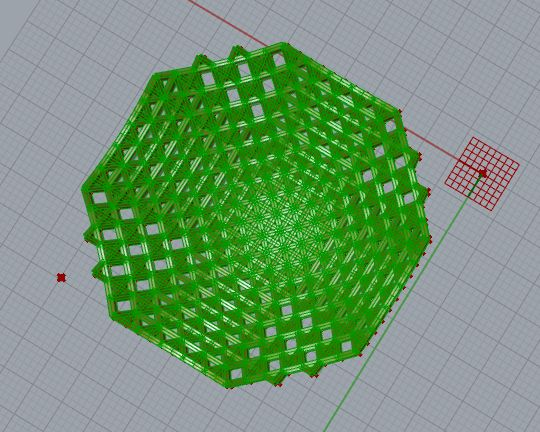
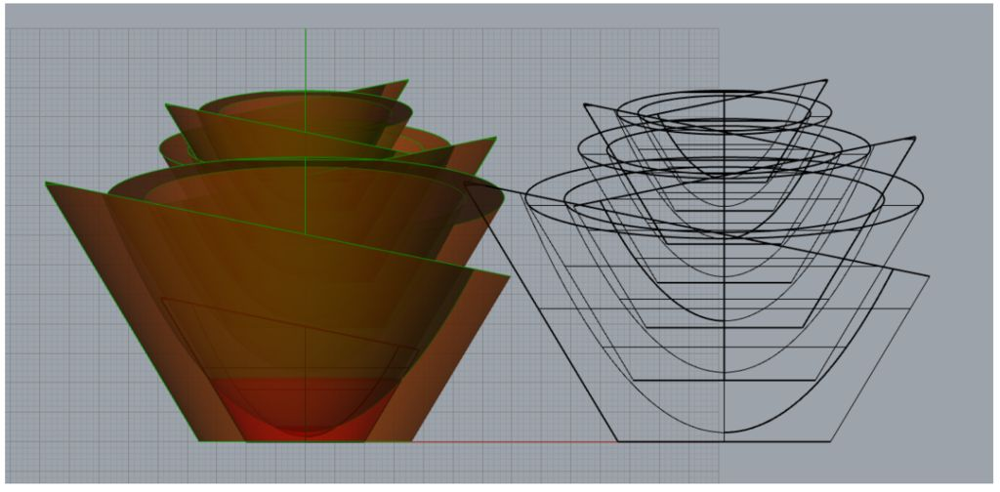
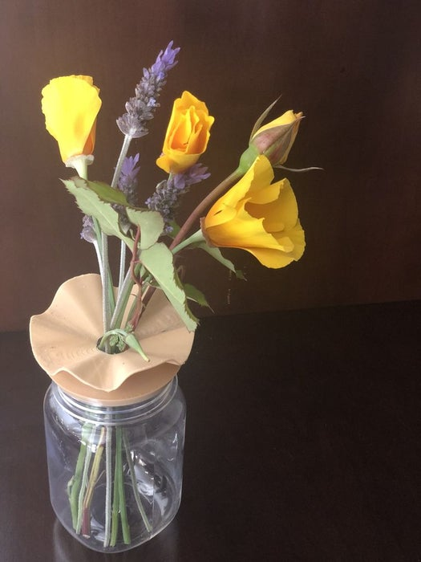
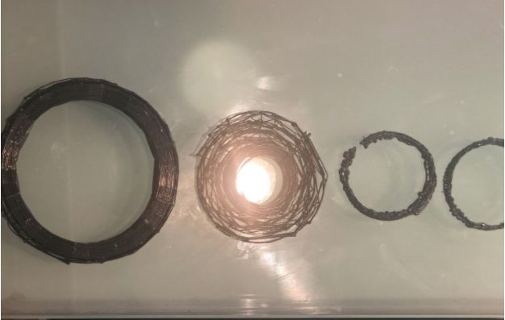
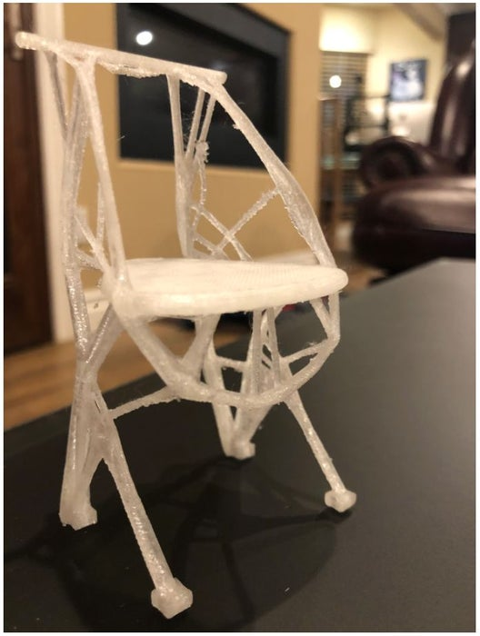
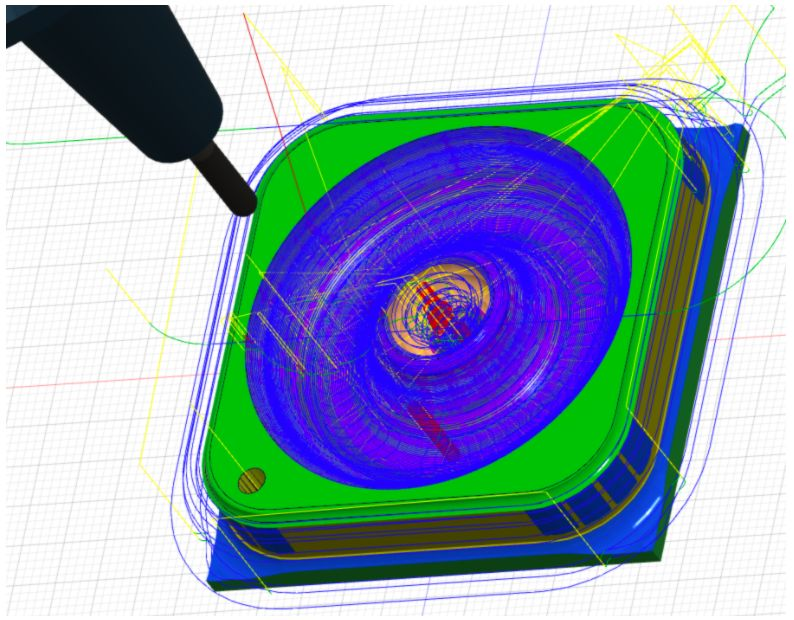

# MAT594x Computational Fabrication

Sonia's git repo for work done for MAT594X Computational Fabrication taught by Prof. Jennifer Jacobs at the University of Santa Barbara California in Spring 2020.

The documentation corresponding to projects can be found below.

#### Week 1:  2.5d 3d-printable Parametric Forms
https://www.instructables.com/id/computational-Fabrication-25d-3d-printable-Paramet/

<!--  -->

#### Week 2: Nested Objects
https://www.instructables.com/id/Computational-Fabrication-Nested-Objects/

#### Week 3: Parametric Surfaces & Turning Refitted Household Objects into Vases
https://www.instructables.com/id/computational-Fabrication-Parametric-Surfaces-Turn/

#### Week 4: Generating GCode in Grasshopper and Making Eclipse Coasters
https://www.instructables.com/id/computational-Fabrication-Generating-Gcode-in-Gras/

<!--  -->

#### Week 5: Generative Design in Fusion360 & 3D Printing a Chair
https://www.instructables.com/id/computational-Fabrication-Generative-Design-in-Fus/

#### Week 6: Specifying CAM Toolpaths for a Ring Box in Fusion360

#### Week 7:

#### Final Project
